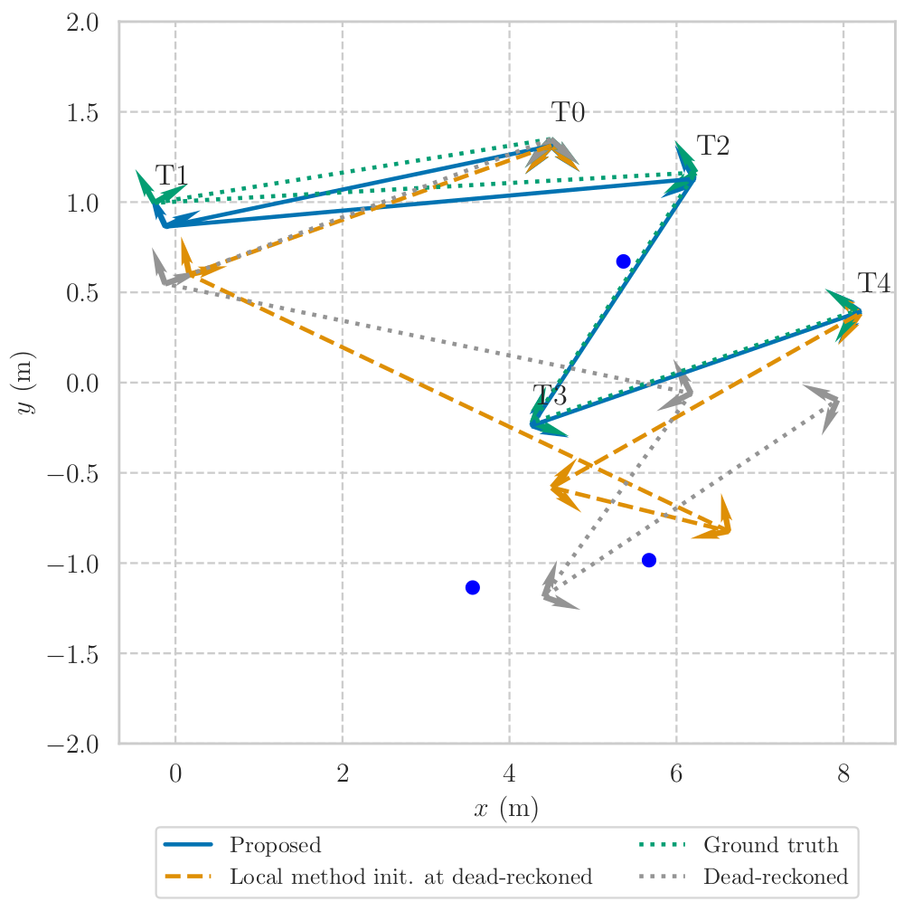

<!-- From https://github.com/othneildrew/Best-README-Template?tab=readme-ov-file -->
<a name="readme-top"></a>

<!-- [![Contributors][contributors-shield]][contributors-url] -->
<!-- [![Forks][forks-shield]][forks-url] -->
<!-- [![Stargazers][stars-shield]][stars-url] -->
[![MIT License][license-shield]][license-url]
[![Issues][issues-shield]][issues-url]
[![LinkedIn][linkedin-shield]][linkedin-url]


<!-- PROJECT LOGO -->
<br />
<div align="center">
  <a href="https://github.com/decargroup/hessian_sum_mixtures">
    
  </a>

<h3 align="center">Certifiably Optimal Data-Association-Free Landmark-Based Localization</h3>

  <p align="center">
    A certifiably optimal semidefinite-relaxation-based method for landmark-based planar localization. 
    This repository contains the companion code for our submission IEEE Robotics and Automation Letters titled "Globally Optimal Data-Association-Free Landmark-Based Localization
    Using Semidefinite Relaxations". 
  </p>
</div>


<!-- The published article may be found [here](https://ieeexplore.ieee.org/document/10607873), -->
The arXiv article may be found [TODO](TODO). The arXiv version also contains the supplementary material. 
## Getting Started
This code was developed with Python 3.8.10. 

PyEnv was used to manage the virtual environment, which can be installed with 
```
curl https://pyenv.run | bash
```
Create and activate virtualenv, 
```
pyenv install 3.8.10
pyenv virtualenv 3.8.10 cert-env2
pyenv activate cert-env2
```
Upgrade pip in case it is not the latest version, 
```
pip install --upgrade pip
```
Initialize the submodules,
```
git submodule update --init 
```
Install general requirements using TODO do I need this?? 
```
python3 -m pip install -r requirements.txt
```

Install the submodules, 
```
python3 -m pip install -e  ./navlie
python3 -m pip install -e  ./pyfactorgraph
python3 -m pip install -e  ./pylgmath
python3 -m pip install -e  ./constraint_learning
python3 -m pip install -e  ./certifiable-tools
python3 -m pip install -e  ./poly_matrix
```

Install the project library, 
```
python3 -m pip install -e ./certifiable_uda_loc/
```

The paths are configured in the ```path_config.py```. 
Please modify the ```project_root_dir``` variable to be the root directory of wherever this project is on your machine. 

Run tests using 
```
python3 scripts/0_tests.py
```

## Reproducing Results From Our Paper
Please run the corresponding Python scripts. 
For the simulation results, 
```
python3 scripts/1_analysis_simulation.py
```
For the Lost in the Woods results, 
```
python3 scripts/2_analysis_lost_in_the_woods.py
```

## Troubleshooting
For issues relating to finding headers for ```sparseqr```, try 
```
sudo apt-get install libsuitesparse-dev
```

## Citation
If you find this code useful, please consider citing our article, 
```
TODO
```

<!-- LICENSE -->
## License

Distributed under the MIT License. See `LICENSE.txt` for more information.

## Contact

Vassili Korotkine - [@decargroup](https://twitter.com/decargroup) - vassili.korotkine@mail.mcgill.ca - https://vkorotkine.github.io/

Project Link: [TODO](TODO)
<!-- <p align="right">(<a href="#readme-top">back to top</a>)</p> -->
<!-- ACKNOWLEDGMENTS -->

## Acknowledgments


* This project makes heavy use of [the poly_matrix library for manipulating sparse symmetric matrices](https://github.com/utiasASRL/poly_matrix), as well as [the certifiable-tools library for working with certifiable optimization problems](https://github.com/utiasASRL/certifiable-tools.git), both built by Frederike Duembgen and Connor Holmes at University of Toronto. 
* This project uses the [Lost in The Woods dataset](https://github.com/utiasASRL/aer1513) collected at the University of Toronto Autonomous Space Robotics Lab
* This project uses a modified version of [PyFactorGraph](https://github.com/MarineRoboticsGroup/PyFactorGraph) developed by the Marine Robotics Group at MIT. 
* The project uses [navlie library for on-manifold state estimation.](https://github.com/decargroup/navlie), built by the DECAR research group at McGill University. 
* The project is funded via the Natural Sciences and Engineering Research Council of Canada (NSERC) Alliance Grant in collaboration with Denso Corporation.
<p align="right">(<a href="#readme-top">back to top</a>)</p>

<!-- MARKDOWN LINKS & IMAGES -->
<!-- https://www.markdownguide.org/basic-syntax/#reference-style-links -->
<!-- [contributors-shield]: https://img.shields.io/github/contributors/decargroup/hessian_sum_mixtures.svg?style=for-the-badge -->
<!-- [contributors-url]: https://github.com/decargroup/hessian_sum_mixtures/graphs/contributors -->
<!-- [forks-shield]: https://img.shields.io/github/forks/decargroup/hessian_sum_mixtures.svg?style=for-the-badge -->
<!-- [forks-url]: https://github.com/decargroup/hessian_sum_mixtures/network/members -->
<!-- [stars-shield]: https://img.shields.io/github/stars/decargroup/hessian_sum_mixtures.svg?style=for-the-badge -->
<!-- [stars-url]: https://github.com/decargroup/hessian_sum_mixtures/stargazers -->
[issues-shield]: https://img.shields.io/github/issues/decargroup/hessian_sum_mixtures.svg?style=for-the-badge
[issues-url]: https://github.com/decargroup/hessian_sum_mixtures/issues
[license-shield]: https://img.shields.io/github/license/decargroup/hessian_sum_mixtures.svg?style=for-the-badge
[license-url]: https://github.com/decargroup/hessian_sum_mixtures/blob/main/LICENSE
[linkedin-shield]: https://img.shields.io/badge/-LinkedIn-black.svg?style=for-the-badge&logo=linkedin&colorB=555
[linkedin-url]: https://ca.linkedin.com/company/decargroup
[product-screenshot]: images/screenshot.png
<!-- [Next.js]: https://img.shields.io/badge/next.js-000000?style=for-the-badge&logo=nextdotjs&logoColor=white -->
<!-- [Next-url]: https://nextjs.org/ -->
<!-- [React.js]: https://img.shields.io/badge/React-20232A?style=for-the-badge&logo=react&logoColor=61DAFB -->
<!-- [React-url]: https://reactjs.org/ -->
<!-- [Vue.js]: https://img.shields.io/badge/Vue.js-35495E?style=for-the-badge&logo=vuedotjs&logoColor=4FC08D -->
<!-- [Vue-url]: https://vuejs.org/ -->
<!-- [Angular.io]: https://img.shields.io/badge/Angular-DD0031?style=for-the-badge&logo=angular&logoColor=white -->
<!-- [Angular-url]: https://angular.io/ -->
<!-- [Svelte.dev]: https://img.shields.io/badge/Svelte-4A4A55?style=for-the-badge&logo=svelte&logoColor=FF3E00 -->
<!-- [Svelte-url]: https://svelte.dev/ -->
<!-- [Laravel.com]: https://img.shields.io/badge/Laravel-FF2D20?style=for-the-badge&logo=laravel&logoColor=white -->
<!-- [Laravel-url]: https://laravel.com -->
<!-- [Bootstrap.com]: https://img.shields.io/badge/Bootstrap-563D7C?style=for-the-badge&logo=bootstrap&logoColor=white -->
<!-- [Bootstrap-url]: https://getbootstrap.com -->
<!-- [JQuery.com]: https://img.shields.io/badge/jQuery-0769AD?style=for-the-badge&logo=jquery&logoColor=white -->
<!-- [JQuery-url]: https://jquery.com  -->
